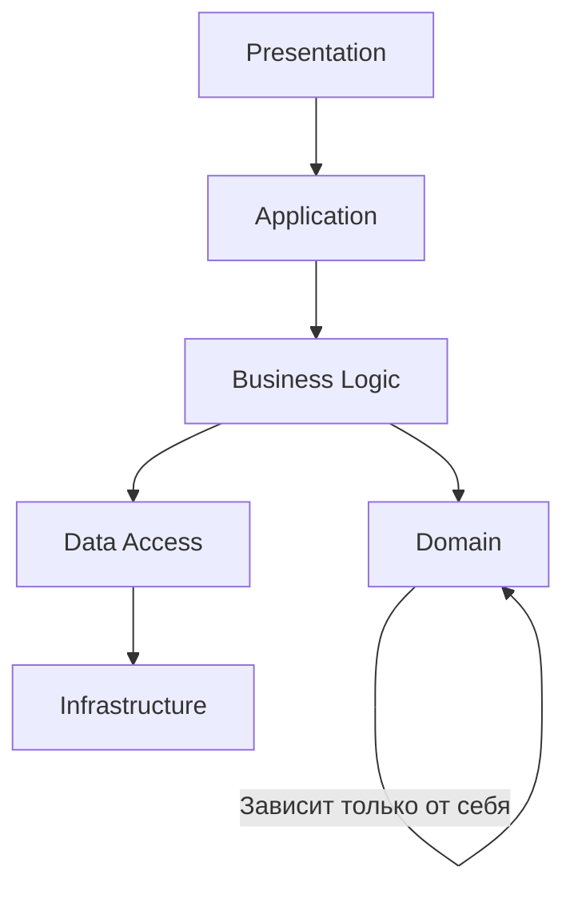

Многоуровневая архитектура - это подход к проектированию приложения, при котором система разделяется на уровни, каждый из который выполняет свою специфическую функцию.

Основные уровни:
- `Уровень представления` (Presentation Layer) - отвечает за взаимодействия с пользователем и отображение данных (считай, контроллеры)
- `Уровень бизнес-логики` (Business Logic Layer) - содержит основные правила и операции предметной области (считай, сервис)
- `Уровень доступа к данным` (Data Access Layer) - обеспечивает взаимодействие с хранилищем данных (считай, репозиторий)

Расширенная архитектура (5+ слоёв):
- Domain Layer - чистые бизнес-модели, без зависимости от инфраструктуры (считай, сущности)
- Infrastructure Layer - внешние сервисы - email, SMS, платёжные шлюзы
- Application Layer - Координация между бизнес-логикой и внешним миром

Преимущества многоуровневой архитектуры:
1. Разделение ответственности - каждый уровень выполняет свою задачу
2. Упрощение тестирования - можно тестировать уровни независимо
3. Гибкость - легче вносить изменения в один уровень без влияния на другие
4. Масштабируемость - каждый уровень масштабируется независимо
5. Строгая иерархия зависимостей

Есть также дополнительные уровни:
 - Уровень API - для Restful и GraphQL интерфейсов
 - Уровень интеграции - для работы с внешними сервисами
 - Уровень безопасности - для аутентификации или авторизации

### Что лежит на каждом уровне?

#### Presentation Layer
Роль: Взаимодействие с пользователем или внешними системами
Содержит:
- Контроллеры (REST API, GraphQL, WebSocket)
- DTO -
- Middleware (аутентификация, валидация, логирование)
- UI компоненты

#### Application Layer
Роль: Оркестрация бизнес-процессов, координация между слоями.
Содержит:
- Use Cases - сценарии применения
- CQRS-обработчики (Command\Query)
- Транзакционность (если не в БД)

```php
public class CreateOrderUseCase {
	public function __construct() {}

	public function(CreateOrderCommand $command):void
	{
		// Валидация
		// Вызов Domain Layer
		// Сохранение через Data Access Layer
		// Отправка уведомления через Infrastructure Layer
	}
}
```

#### Domain Layer
Роль: Чистая бизнес-логика и модели
Содержит:
- Сущности
- Агрегаты
- Доменные события
- Value Objects

Никаких зависимостей от других слоёв, только свои абстракции.

#### Business Logic Layer
Роль: Реализация сложных правил и процессов.

Содержит:
- Сервисы

#### Infrastructure Layer
Роль: Работа с внешним миром
Содержит:
- Реализации репозиториев
- Внешние API
- Конфигурацию (БД, кеш, очереди)

#### Data Access Layer
Роль: Взаимодействие с хранилищами
Содержит:
- Интерфейс репозиториев
- Query объекты

### Стрелка зависимостей

Presentation
↓
Application
↓
Business Rule
↓
Domain
↓
Infrastructure
↓
Data Access

### Стандарты многослойной архитектуры
1. 3 слоя (Presentation + Business + Data Access)
2. 4 слоя + Domain
3. 6 слоёв - сложные интерпрайс системы с чёткими границами
4. 2 слоя - Domain и Infrastructure - чистая архитектура

